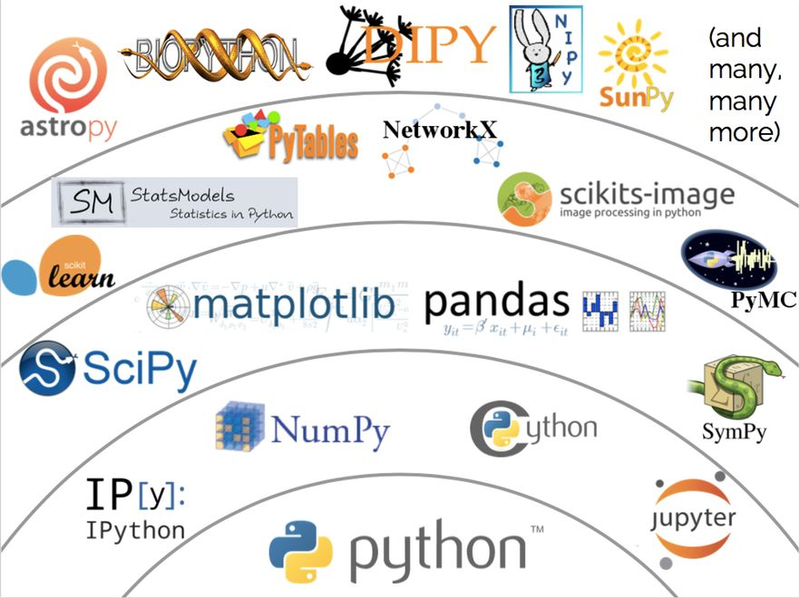

# MathModeling
Python tools for math modeling

### 文件结构
- Basic: 基础工具使用方法
  - Sympy
    符号计算库
  - networkx
    图论处理库
- Experiment: 具体实验
- Knowledge: 理论知识及其python实现

### 文档
待编辑---
[mathmodeling](https://mathmodeling.readthedocs.io/en/latest/)
